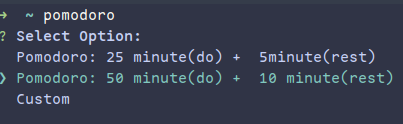

# Pomodoro-CLI

My personal pomodoro timer base in CLI (NodeJS), 
Purposes to use this tool is to retain my productivity, avoid phone as distracted stuff for me.. So i have more time to learn code or so.


## Installation
First you should clone this repo

```git
$ git clone https://github.com/akhdrzki/Pomodoro-CLI.git
```
Open the directory
```bash
$ cd Pomodoro-CLI
```
Install
```npm
$ npm install 
```
Don't forget to make it global (available to run this cli outside directory)
```bash
$ npm install -g
```


## Usage
After install it as global, simply type

```bash
$ pomodoro
```


## Example


